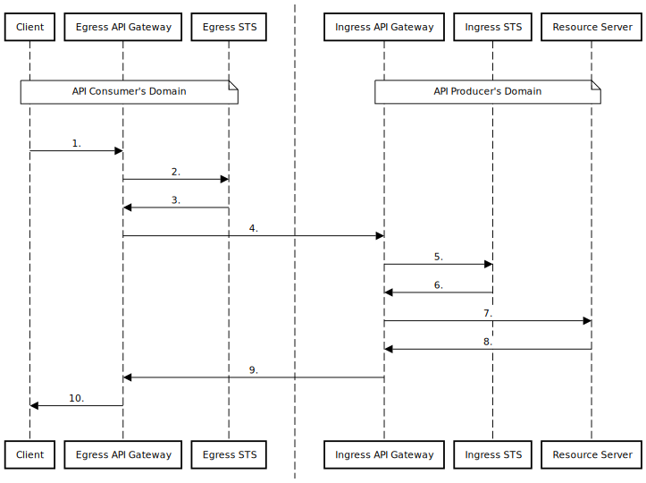

# Propagator

Propagator, a web API-to-API security framework, is a prototype implementation of the [Identity Propagation and Assertions](https://github.com/umalabs/identity-propagation-and-assertions) architecture. Propagator uses this architecture to convey the user's security context alongside messages between API consumers and API producers. The API-to-API communication resembles how the MTA-to-MTA SMTP transmission works. You can send any message, e.g., an order, from the sender's API to an arbitrary recipient's API; vice-versa, you can receive a message from any sender's API.

## Motivation

To create a system that will form the backbone of API-to-API interactions, just as email forms the backbone of user-to-user interaction.

## MTA-to-MTA vs. API-to-API Comparison

Email MTA-to-MTA vs. API-to-API Propagator comparison.

| Capabilities & Features      | MTA-to-MTA (SMTP-to-SMTP) | API-to-API (HTTP-to-HTTP)       |
| ---------------------------- | ---------------------------- | ---------------------------------- |
| Main capability              | Send a message               | Call an API                        |
| Information exchange mode    | Store-and-forward            | Store-and-forward, Real-time       |
| Communication                | One-way                      | Request–response, (bidi) streaming |
| Multiple recipients          | Yes                          | Yes                                |
| Data flow                    | push                         | push/pull                          |
| Large binary data transfer   | No                           | Yes                                |
| Data manipulation            | N/A                          | CRUD operations                    |
| No sign-up at recipients     | Yes                          | Yes                                |
| Client authentication        | DANE                         | JWT/mTLS                           |
| User authentication          | N/A                          | Via client (on behalf of a user)   |

## Sequence Diagram

## Repositories

* API-to-API Security Token Service [https://github.com/umalabs/api-to-api-sts](https://github.com/umalabs/api-to-api-sts)  
* API-to-API Gateway [https://github.com/umalabs/api-to-api-gateway](https://github.com/umalabs/api-to-api-gateway)
