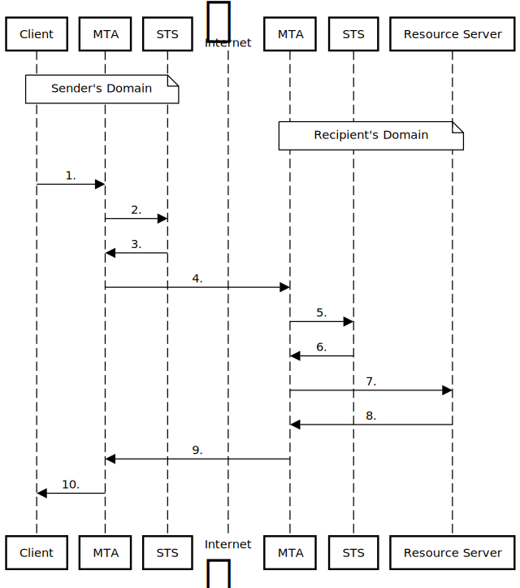

# Federizer

Federizer, a gRPC message transfer agent (MTA), is a prototype implementation of the [Identity Propagation and Assertions](https://github.com/umalabs/identity-propagation-and-assertions) architecture. Federizer uses this architecture to convey the user's security context alongside messages between MTAs. The Federizer communication resembles how the MTA-to-MTA SMTP transmission works. You can send any message, e.g., an order, from the sender to an arbitrary recipient's API; vice-versa, you can receive a message from any sender.

## Motivation

To create a system that will form the backbone of service-to-service interactions, just as email forms the backbone of user-to-user interaction.

## Email SMTP MTA-to-MTA vs. Federizer gRPC MTA-to-MTA Comparison

Email MTA-to-MTA vs. Federizer MTA-to-MTA comparison.

| Capabilities & Features      | SMTP-to-SMTP                 | gRPC-to-gRPC                       |
| ---------------------------- | ---------------------------- | ---------------------------------- |
| Main capability              | Send a message               | Call an API                        |
| Information exchange mode    | Store-and-forward            | Store-and-forward, Real-time       |
| Communication                | One-way                      | Request–response, (bidi) streaming |
| Multiple recipients          | Yes                          | Yes                                |
| Data flow                    | push                         | push/pull                          |
| Large binary data transfer   | No                           | Yes                                |
| Data manipulation            | N/A                          | CRUD operations                    |
| No sign-up at recipients     | Yes                          | Yes                                |
| Client authentication        | DANE                         | JWT/mTLS                           |
| User authentication          | N/A                          | Via client (on behalf of a user)   |

## Sequence Diagram

## Demo

As a demo, we've created an email-like system where the first-class citizen is not a message but a file.
